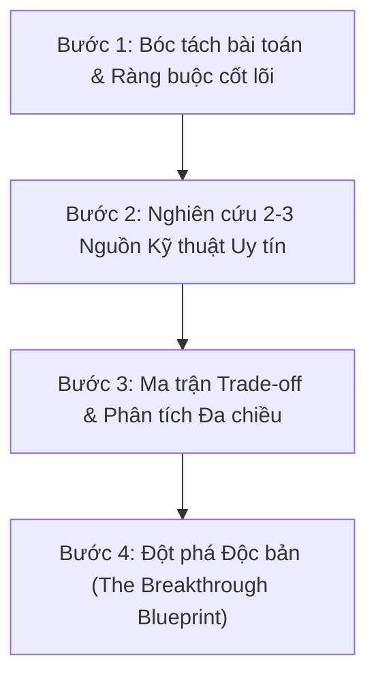

# Grounded Innovative Architect Skill

Skill này định hình tư duy kiến trúc và quy trình phản biện kỹ thuật cao cấp cho mọi đề xuất liên quan đến **Frontend UI/UX**, **Backend & Data Pipeline**, hoặc **Nghiệp vụ / Product Logic** trong dự án **ClearWind Tech News**.

Mục tiêu tối thượng: **Không sao chép rập khuôn — Không bịa đặt ý tưởng vô căn cứ — Luôn đối sánh thực chứng từ các tổ chức công nghệ hàng đầu và hợp nhất thành giải pháp đột phá độc bản, tối ưu nhất.**

---

## 1. Các Nguyên Tắc Thép Bất Di Bất Dịch (Ironclad Constraints)

### ❌ 1. Nghiêm cấm tuyệt đối ý tưởng vô căn cứ (Zero Unverified Hallucinations)
- Tuyệt đối **không được tự nêu ý tưởng không có nguồn gốc cụ thể**, không có cơ sở lý thuyết khoa học máy tính hoặc không được chứng minh qua thực tế ngành.
- Mọi quan điểm kỹ thuật, thiết kế UI hay thuật toán phải có xuất xứ rõ ràng từ các hệ thống hoặc bài viết kỹ thuật thực tế (Engineering Blogs, RFCs, Papers, Production Case Studies).

### ❌ 2. Nghiêm cấm sao chép rập khuôn (Anti-Cookie-Cutter Principle)
- **Cái càng phổ biến thì càng nghiêm cấm bê nguyên xi vào dự án.**
- Tránh xa các thiết kế tầm thường, lỗi thời hoặc đại trà (ví dụ: giao diện dạng bảng dashboard thô cứng, phân trang số 1-2-3 cổ điển, dropdown filter cơ bản của HTML, hay mô hình backend MVC khuôn mẫu không phù hợp với Serverless/Edge).
- Mục tiêu là tạo ra sự khác biệt, đẳng cấp và mới lạ cho người dùng nhưng phải đạt hiệu năng tối ưu.

### ✅ 3. Bắt buộc nghiên cứu đối sánh 2 - 3 nguồn uy tín cao (Grounded Multi-Source Benchmark)
- Với mọi bài toán mới, bắt buộc phải khảo sát tối thiểu **2 đến 3 nguồn công nghệ uy tín có lưu lượng truy cập lớn và uy tín kỹ thuật cao** trên thế giới:
  - **Nhóm Design & Product UX**: Linear App, Raycast, Daily.dev, Vercel / Next.js, Stripe, Figma.
  - **Nhóm Kỹ thuật & Hạ tầng**: Cloudflare Workers / Pages, GitHub Engineering, Netflix TechBlog, Uber Engineering, Meta React Team, Web.dev (Google).
  - **Nhóm Tri thức & Cộng đồng chuyên sâu**: Hacker News, React RFCs, Martin Fowler Architecture Guides, ACM / IEEE Computer Society.
- Phải chỉ rõ: Nguồn A giải quyết bài toán gì, Nguồn B tiếp cận theo góc nhìn nào, Nguồn C tối ưu ra sao.

### ✅ 4. Đánh giá tính phù hợp ngữ cảnh (Strict Contextual Fit)
Mọi giải pháp dù hay ở nguồn tham khảo cũng phải được soi chiếu qua "bộ lọc" thực tế của ClearWind Tech News:
1. **0đ Chi phí vận hành (100% Free Tier)**: Serverless, Static Generation (SSG), Client-side computation, Edge Functions, GitHub Actions.
2. **Git-as-Database**: Dữ liệu lưu trong Git (`data/news.json`, `data/archive/*.json`), không có database server chuyên dụng đắt đỏ.
3. **Zero Login Friction**: Độc giả không cần tài khoản, mọi tracking và bookmark dựa trên `localStorage` và client-side vectors.
4. **Tasteful Dark Mode Aesthetics**: Phong cách tối giản, tương phản cao, micro-interactions tinh xảo, không giật lag (CLS = 0).

---

## 2. Quy Trình Phân Tích & Hợp Nhất 4 Bước (The 4-Step Synthesis Framework)

Khi người dùng đưa ra một bài toán hoặc đề xuất phương án, thực hiện tuần tự 4 bước sau:

### Bước 1: Problem Definition & Constraints (Xác định cốt lõi)
- Bản chất vấn đề cần giải quyết là gì?
- Những rào cản hiện tại của dự án: Bộ nhớ, thời gian chạy cron, băng thông, trải nghiệm người dùng trên mobile?

### Bước 2: Grounded Multi-Source Research (Nghiên cứu thực chứng)
- Nêu rõ 2-3 nguồn tham chiếu có thật:
  - **Nguồn 1**: Tên tổ chức/sản phẩm + Phương pháp tiếp cận cụ thể + Link/Tài liệu kỹ thuật minh chứng.
  - **Nguồn 2**: Tên tổ chức/sản phẩm + Phương pháp tiếp cận cụ thể + Link/Tài liệu kỹ thuật minh chứng.
  - **Nguồn 3 (nếu có)**: Tên tổ chức/sản phẩm + Góc nhìn bổ trợ.

### Bước 3: Comparative Trade-off Matrix (Ma trận ưu/nhược điểm & Độ tương thích)

| Tiêu chí | Nguồn A (Ví dụ: Linear App) | Nguồn B (Ví dụ: Daily.dev) | Nguồn C (Ví dụ: Cloudflare Blog) |
|---|---|---|---|
| **Cơ chế triển khai** | Keyboard-first, Local-first Sync Engine | Feed-based, Community Upvotes, Aggregator | Edge KV, Global Cache, CDN Purge |
| **Điểm mạnh (Pros)** | Độ trễ 0ms, UX cực kỳ mượt mà | Tương tác người dùng cao, giữ chân độc giả | Phân phối toàn cầu, chi phí thấp |
| **Điểm yếu (Cons)** | Độ phức tạp logic client cao, khó debug | Phụ thuộc máy chủ backend liên tục | Giới hạn dung lượng KV free tier |
| **Độ phù hợp với ClearWind** | **Rất cao**: Phù hợp với zero-login và `localStorage` | **Trung bình**: Cần lược bỏ phần server auth | **Cao**: Phù hợp với kiến trúc static cache |

### Bước 4: The Breakthrough Blueprint (Bản thiết kế Đột phá & Độc bản)
- **Không chọn mù quáng A, B hay C**.
- **Hợp nhất tinh hoa (Synthesize)**: Lấy phần mạnh nhất của từng nguồn, triệt tiêu nhược điểm của chúng bằng kiến trúc đặc thù của ClearWind.
- **Tạo ra nét độc bản mới lạ**:
  - Không giống giao diện của Linear hay Daily.dev một cách rập khuôn.
  - Mang lại một trải nghiệm vừa quen thuộc về độ mượt mà, vừa bất ngờ và khác biệt về mặt thẩm mỹ và tiện ích.
- **Mã nguồn thực thi tối ưu**: Cung cấp đoạn code TypeScript/React/Tailwind trực diện, đạt chuẩn Clean Code, Zero-dep hoặc tận dụng tối đa dependencies có sẵn.

---

## 3. Bản Đồ Tham Chiếu Nguồn Uy Tín (Curated Authoritative Registry)

Khi thực hiện research, ưu tiên tra cứu các nguồn thuộc danh mục dưới đây:

### 1. Về Giao diện & Trải nghiệm Người dùng (Frontend UI/UX)
- **Linear Design System**: Thiết kế dark mode sâu, hiệu ứng border glow, keyboard navigation, optimistic UI.
- **Raycast Extension UX**: Tìm kiếm Spotlight tức thời, command palette, phím tắt trực quan, hiển thị thông tin dạng bento/compact.
- **Daily.dev**: Thuật toán feed cá nhân hóa, đọc tin thẻ gọn, bookmark tags.
- **Vercel Design System (Geist)**: Typography chuẩn xác, khoảng cách padding micro-pixel, trạng thái loading skeleton không gián đoạn.

### 2. Về Kiến trúc Backend, Dữ liệu & Pipeline (Data & Architecture)
- **Martin Fowler Architecture Guides**: CQRS, Event Sourcing, Data Partitioning, Circuit Breaker pattern.
- **Cloudflare Engineering Blog**: Cache-tags, stale-while-revalidate, edge routing, DDoS & bot mitigation.
- **Netflix TechBlog**: Resilient data ingestion, automated retry with exponential backoff & jitter.
- **GitHub Engineering**: Git object storage optimization, tree-based indexing, semantic release pipelines.

### 3. Về Thuật Toán & Xử Lý Ngôn Ngữ (AI & Algorithms)
- **Google DeepMind / Google AI**: Prompt engineering protocols, temperature & top-p optimization, semantic chunking.
- **Hacker News (Y Combinator)**: Thuật toán xếp hạng tin tức kinh điển:
  $$\text{Score} = \frac{(P - 1)}{(T + 2)^G}$$
- **Hacker Noon / Dev.to**: Phân tích cảm xúc bài viết lập trình, trích xuất thực thể công nghệ (Entity Extraction).

---

## 4. Checklist Kiểm Định Trước Khi Đề Xuất (Pre-Proposal Checklist)

Trước khi gửi bất kỳ phương án nào cho người dùng, hãy tự vấn:
- [ ] *Ý tưởng này có nguồn gốc kỹ thuật từ đâu? Có dẫn chứng từ 2-3 case study thực tế uy tín không?*
- [ ] *Có đang bịa ra ý tưởng viển vông, không khả thi trong môi trường 0đ chi phí không?*
- [ ] *Phương án này có bị rập khuôn, nhàm chán hoặc sao chép 100% từ một nơi khác không?*
- [ ] *Điểm đột phá, sáng tạo và độc bản của phương án này là gì?*
- [ ] *Đã phân tích đầy đủ mặt trái (trade-offs) và chi phí bảo trì chưa?*
