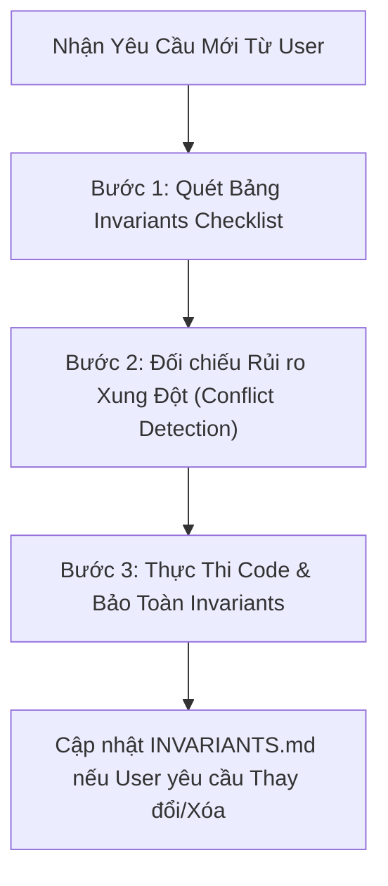

# Project Invariants Keeper Skill

Skill này đóng vai trò là **Bộ Nhớ Bất Biến (Immutable Core Anchors)** của dự án **ClearWind Tech News**. 

Mục tiêu tối thượng: **Đảm bảo AI không bao giờ bỏ sót, vô tình phá vỡ hoặc quên bẵng các ràng buộc kiến trúc và tính năng nền tảng đã được thống nhất từ trước — ngay cả khi người dùng không nhắc lại trong các prompt tiếp theo.**

---

## 1. Bản Đồ Các Yêu Cầu Bất Biến Hiện Hành (Active Project Invariants)

Mọi dòng code, component hay tính năng mới phải tuân thủ nghiêm ngặt bảng Invariants dưới đây (được đồng bộ tại `INVARIANTS.md`):

| Nhóm Invariant | Ràng Buộc Bất Biến (Immutable Rule) | Điều Cấm Tuyệt Đối (Anti-Pattern) |
|---|---|---|
| **1. UI Theme** | Hỗ trợ đầy đủ **Dark / Light Mode** mượt mà. Nền Dark Mode OLED sâu (`#090A0F`), viền mờ tinh xảo (`border-white/10`). | CẤM hardcode màu cố định gây vỡ tương phản khi đổi theme; CẤM class dynamic Tailwind kiểu `dark:${color}` không an toàn. |
| **2. Song Ngữ (Bilingual)** | Mọi nhãn văn bản, tiêu đề, nút bấm và nội dung phải hỗ trợ song song **Tiếng Việt (VI)** và **Tiếng Anh (EN)** thông qua `useBilingual()` / `BilingualContext`. | CẤM hardcode chuỗi text đơn ngữ cứng trong JSX; CẤM để lọt tiếng Anh thô trong chế độ VI hoặc ngược lại. |
| **3. Bộ Icon Thống Nhất** | Thống nhất 100% bằng thư viện **`lucide-react`**. | CẤM tuyệt đối chèn emoji thô (`🇻🇳`, `🌐`, `🔥`, `⚡`, `✨`...) vào JSX làm icon; CẤM trộn lẫn thư viện icon khác. |
| **4. Zero Login Friction** | Độc giả trải nghiệm đầy đủ 100% tính năng (Bookmark, Tracking sở thích, Đọc tin) mà **không cần đăng nhập tài khoản**. Toàn bộ dữ liệu người dùng lưu an toàn tại `localStorage`. | CẤM yêu cầu đăng nhập, CẤM chặn tính năng bằng auth-wall hay session server tốn phí. |
| **5. Chi Phí Vận Hành 0đ** | Toàn bộ hệ thống chạy trên **100% Free Tier**: Vercel SSG / Cloudflare, Git-as-Database (`data/news.json`, `data/archive/`), GitHub Actions Cron. | CẤM tự ý thêm database trả phí, máy chủ VPS riêng hoặc dịch vụ đám mây có phí duy trì. |
| **6. Chuẩn Hóa Tìm Kiếm** | **Duy nhất một thanh tìm kiếm Spotlight (`⌘K`) trên Navbar**. Thanh Command Bar dưới Feed tập trung vào bộ lọc chuyên sâu. | CẤM tạo thêm ô input tìm kiếm trùng lặp dưới Feed làm rác giao diện. |
| **7. Toàn Vẹn Dữ Liệu & Zod** | Mọi dữ liệu trước khi lưu vào DB hoặc đưa lên State/UI đều phải vượt qua Zod schema `NewsItemSchema.safeParse()`. | CẤM lạm dụng toán tử `||` mơ hồ; CẤM đưa dữ liệu chưa validate hoặc thiếu trường lên UI. |
| **8. Tóm Tắt 3 Điểm Vàng** | Toàn bộ tóm tắt bài viết (`summary_vi` & `summary_en`) bắt buộc có đúng 3 bullet points kỹ thuật sâu, có giá trị thực tiễn cho lập trình viên. | CẤM tóm tắt 1 câu hời hợt, CẤM dùng câu chung chung sáo rỗng kiểu "bài viết cập nhật thông tin". |
| **9. Chiến Lược Git Flow** | Toàn bộ coding và commit phát triển tính năng đều diễn ra trên nhánh **`develop`**. Nhánh `main` chỉ nhận merge tự động định kỳ 1 tuần/lần từ `develop`. | CẤM push code trực tiếp lên `main` làm đứt gãy production. |

---

## 2. Quy Trình Vận Hành 3 Bước (Pre-Execution Invariants Check)

Trước khi viết hoặc sửa đổi bất kỳ đoạn code nào, AI bắt buộc thực hiện 3 bước kiểm tra:

### Bước 1: Quét Checklist Trước Khi Viết Code
Tự vấn bản thân:
- [ ] *Component mới có hỗ trợ cả Dark và Light mode không?*
- [ ] *Mọi chuỗi hiển thị đã được đưa vào `BilingualContext` (cả `vi` và `en`) chưa?*
- [ ] *Toàn bộ icon đã dùng `lucide-react` chưa, có vô tình nhét emoji thô vào không?*
- [ ] *Tính năng có đòi hỏi user đăng nhập không? (Phải dùng `localStorage`)*
- [ ] *Có làm ảnh hưởng đến kiến trúc 0đ chi phí hoặc Git-as-DB không?*

### Bước 2: Phòng Ngừa Quên Ngữ Cảnh (Zero Context Drift)
- Ngay cả khi prompt của người dùng chỉ ghi ngắn gọn: *"thêm nút chia sẻ bài viết"* hay *"tạo modal thông tin"*:
  - **Mặc định tự động**: Nút chia sẻ phải có icon `Share2` từ `lucide-react`, text hiển thị từ `t.share`, hoạt động tốt trên cả Dark/Light mode, không cần đăng nhập.
  - Tuyệt đối không để xảy ra trường hợp: Người dùng không nhắc dark mode thì AI viết code chỉ chạy trên white background; người dùng không nhắc song ngữ thì AI viết mỗi tiếng Anh hoặc mỗi tiếng Việt.

### Bước 3: Cơ Chế Cập Nhật & Xóa Bỏ Invariants (Dynamic Mutation)
Khi người dùng đưa ra các yêu cầu thay đổi nền tảng:
1. **Yêu cầu THÊM invariant mới** (Ví dụ: *"từ giờ thêm quy định mọi ảnh phải có blur placeholder"*):
   - Bổ sung ngay invariant này vào file `INVARIANTS.md` và `AGENTS.md`.
2. **Yêu cầu SỬA / NÂNG CẤP invariant** (Ví dụ: *"thay đổi màu accent từ emerald sang cyan"*):
   - Cập nhật định nghĩa mới trong `INVARIANTS.md`.
3. **Yêu cầu GỠ BỎ / REMOVE invariant** (Ví dụ: *"bỏ chế độ light mode, chỉ giữ duy nhất dark mode"*):
   - Xóa bỏ dòng invariant đó khỏi `INVARIANTS.md` và ghi log lý do người dùng yêu cầu gỡ bỏ.

---

## 3. Quy Ước Báo Cáo Tuân Thủ (Compliance Reporting)

Sau khi hoàn thành code, trong phần tóm tắt gửi người dùng, luôn có một dòng xác nhận ngắn gọn:
> *🛡️ **Invariants Verified**: Đã bảo toàn 100% Dark/Light mode, Song ngữ (VI/EN), Lucide icons và Zero-login storage.*
