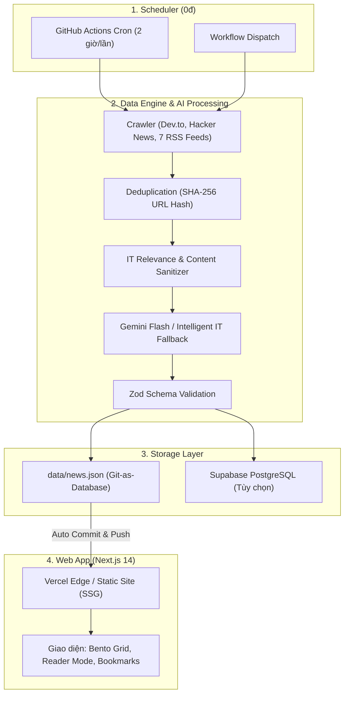

# ClearWind Tech News

Nền tảng tổng hợp, phân tích và tóm tắt tin tức công nghệ song ngữ (Việt - Anh) vận hành tự động 24/7. Dự án kết hợp Next.js 14, mô hình ngôn ngữ Google Gemini và cơ chế Git-as-Database để duy trì hệ thống cập nhật liên tục với chi phí vận hành 0đ.

---

## 🏛️ Kiến trúc hệ thống (System Architecture)



---

## 🚀 Tính năng cốt lõi

- **Tự động hóa hoàn toàn 24/7**: Định kỳ mỗi 2 tiếng, GitHub Actions tự động cào tin từ 9 nguồn uy tín, phân tích nội dung, trích xuất điểm kỹ thuật cốt lõi và cập nhật trang web.
- **Tóm tắt kỹ thuật 3 điểm vàng**: Phân tích bối cảnh, giải pháp kiến trúc/thông số kỹ thuật và bài học thực tiễn cho kỹ sư phần mềm; loại bỏ hoàn toàn các câu tóm tắt chung chung rập khuôn.
- **Hỗ trợ song ngữ (Bilingual VI/EN)**: Tự động dịch tiêu đề và tóm tắt tin quốc tế sang tiếng Việt chuẩn thuật ngữ IT; hỗ trợ chuyển đổi nhanh giao diện giữa Tiếng Việt và Tiếng Anh.
- **Bộ lọc IT & Chống cào rác (Sanitizer)**: Loại bỏ các thẻ điều hướng, menu quảng cáo, thông tin phi công nghệ (gia dụng, showbiz, xe xăng) để giữ dữ liệu thuần túy kỹ thuật.
- **Fallback Engine độc lập (0đ chi phí)**: Khi API Gemini chạm giới hạn quota hoặc gián đoạn mạng, hệ thống tự động kích hoạt pipeline dịch thuật và sinh điểm nhấn chuyên ngành theo danh mục, đảm bảo tiến trình không bao giờ lỗi.
- **Giao diện hiện đại phong cách Linear / Daily.dev**:
  - Tông màu Dark mode cao cấp, bố cục Bento Grid kết hợp Compact View.
  - Reader Mode tập trung với tùy chỉnh cỡ chữ và chia sẻ nhanh.
  - Lưu bài viết (Bookmark) và Upvote tức thì vào `localStorage` không cần đăng nhập.
  - Phím tắt tiện lợi: `Ctrl + K` (Tìm kiếm), `V` (Đổi chế độ xem), `L` (Đổi ngôn ngữ), `B` (Mở Bookmark).

---

## 🛠️ Công nghệ sử dụng (Tech Stack)

| Thành phần | Công nghệ | Mục đích |
| :--- | :--- | :--- |
| **Framework** | Next.js 14 (App Router) | Server Components, SSG tối ưu SEO và tốc độ tải |
| **Language** | TypeScript | Kiểm soát kiểu dữ liệu nghiêm ngặt toàn bộ dự án |
| **Styling** | Tailwind CSS | Thiết kế giao diện hiện đại, responsive và dark mode |
| **AI Engine** | Google Gemini API (`gemini-2.5-flash`, `2.0-flash`) | Phân tích bài viết, tóm tắt 3 điểm, gắn tag và chấm Hot Score |
| **Data Engine** | `rss-parser`, Zod | Cào RSS/API, trích xuất nội dung và xác thực schema |
| **Database** | `data/news.json` (Git-as-DB) | Lưu trữ an toàn, có version control, chi phí 0đ |
| **CI/CD** | GitHub Actions | Cronjob chạy pipeline tự động và commit dữ liệu |
| **Deployment** | Vercel | Hosting static web tốc độ cao trên Edge Network |

---

## 📡 Nguồn dữ liệu (Data Sources)

Dự án cân đối tỉ lệ ~70% nguồn Việt Nam và ~30% nguồn quốc tế:

- **Việt Nam**: VnExpress Số Hóa, GenK, Tinh Tế, VietNamNet ICT, Tuổi Trẻ Nhịp Sống Số, Viblo Tech.
- **Quốc tế**: Dev.to (Official REST API), Hacker News (Firebase REST API), The Verge, Ars Technica.

---

## 💻 Cài đặt & Chạy cục bộ (Local Setup)

### 1. Clone repository
```bash
git clone https://github.com/ClearWind9u/ClearWind-Tech-News.git
cd ClearWind-Tech-News
```

### 2. Cài đặt thư viện
```bash
npm install
```

### 3. Cấu hình biến môi trường (Tùy chọn)
Tạo file `.env.local` ở thư mục gốc:
```env
# Lấy miễn phí tại: https://aistudio.google.com/app/apikey
GEMINI_API_KEY=your_gemini_api_key_here
```
*(Lưu ý: Nếu không cấu hình key, pipeline sẽ tự động sử dụng Fallback Engine để bạn vẫn chạy thử và phát triển giao diện bình thường).*

### 4. Chạy kiểm thử pipeline & server
```bash
# Kiểm tra và dọn dẹp database
npm run clean-db

# Chạy crawler lấy tin mới
npm run fetch-news

# Khởi động server phát triển
npm run dev
```
Mở trình duyệt tại: `http://localhost:3000`

---

## 🚢 Triển khai (Deployment & Automation)

### 1. Deploy lên Vercel
1. Import repository vào tài khoản [Vercel](https://vercel.com).
2. Chọn framework **Next.js** và nhấn **Deploy** (không cần cấu hình thêm).

### 2. Cấu hình tự động hóa GitHub Actions
1. Trên GitHub repo, vào **Settings** -> **Secrets and variables** -> **Actions** -> thêm Secret:
   - `GEMINI_API_KEY`: API Key lấy từ Google AI Studio.
2. Vào **Settings** -> **Actions** -> **General** -> mục **Workflow permissions**:
   - Chọn **Read and write permissions** để workflow tự động commit dữ liệu mới.
   - Nhấn **Save**.

Sau khi cài đặt, GitHub Actions sẽ định kỳ chạy job cào tin và Vercel sẽ tự động build lại website tĩnh (SSG) trong vài chục giây.

---

## 📁 Cấu trúc dự án

```text
├── .agents/                           # AI Agent Skills & Quy chuẩn kiến trúc
│   ├── rules/                         # Quy định về code quality, git flow, data integrity
│   └── skills/                        # 8 Skills chuyên môn hóa (crawler, summarizer, UI/UX...)
├── .github/workflows/
│   ├── update_news.yml                # Cronjob tự động cào tin mỗi 2 tiếng
│   └── weekly_merge_develop_to_main.yml # Tự động đồng bộ develop -> main
├── app/                               # Next.js 14 App Router (Layout, Page, Styling)
├── components/                        # UI Components (Bento Hero, NewsCard, ReaderModal...)
├── data/
│   └── news.json                      # Database tin tức (Git-as-Database)
├── lib/                               # Data layer & helper kết nối Supabase/Local DB
├── scripts/
│   ├── fetch_news.ts                  # Pipeline cào RSS/API, trích xuất và tóm tắt tin
│   ├── it_translator.ts               # Bộ dịch thuật IT và phân tích kỹ thuật dự phòng
│   └── clean_news_db.ts               # Script kiểm tra, lọc tin phi-IT và chuẩn hóa DB
└── types/
    └── news.ts                        # Zod Schema & TypeScript interfaces
```

---

## 📄 Giấy phép (License)

Dự án được phát hành theo giấy phép [MIT License](LICENSE).
