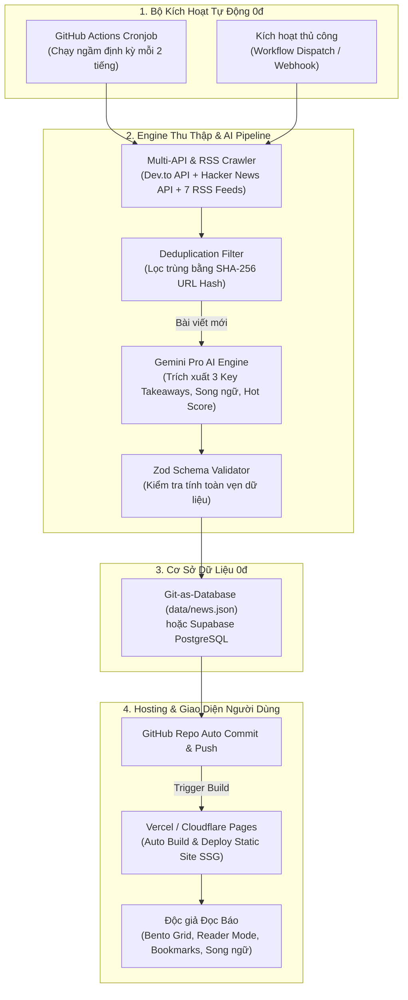

# 🍃 ClearWind Tech News (Làn Gió Tin Tức IT Tự Động 24/7)

Hệ thống tổng hợp, phân tích và tóm tắt tin tức công nghệ đa nguồn hoàn toàn tự động 24/7 bằng **Gemini Pro**, thiết kế giao diện cao cấp (**Tasteful Design** phong cách Daily.dev / Linear), hỗ trợ **Song ngữ (Tiếng Việt 🇻🇳 & Tiếng Anh 🇺🇸, ưu tiên 70% nguồn Việt Nam)** với **chi phí vận hành 0đ (Free Tier 100%)**.

---

## 🧭 Kiến Trúc & Sơ Đồ Hoạt Động 24/7 (Workflow)



---

## 🌟 Những Điểm Nổi Bật & Tính Năng Đột Phá

### 1. 🤖 Trí Tuệ Nhân Tạo Song Ngữ (Gemini Pro)
- **Tóm tắt 3 điểm cốt lõi (Key Takeaways)**: Bóc tách sự kiện chính, thông số kỹ thuật và tác động thực tế của bài báo.
- **Dịch thuật & Bản địa hóa chuẩn IT**: Giữ nguyên tính chuyên môn của các thuật ngữ công nghệ.
- **Tính điểm nóng (Hot Score 🔥 1-100)**: Tự động xếp hạng độ chấn động và sức hút của bài báo.
- **Gán nhãn Category & Tags**: Tự động phân loại vào 6 danh mục chuyên ngành (*AI & Machine Learning, DevOps & Cloud, Cybersecurity, Software Engineering, Mobile & Web, Tech Trends*).

### 2. 🎨 Tasteful Design System & UI/UX Đẳng Cấp
- **Bento Grid Hero**: Bài viết tiêu điểm nổi bật phong cách tạp chí công nghệ số (*The Verge / Daily.dev*).
- **Chế độ xem linh hoạt (Layout Switcher)**:
  - 🍱 **Grid View**: Card bài viết trực quan với ảnh bìa HD, tóm tắt nổi bật và tags.
  - 📋 **Compact View**: Danh sách thông tin cô đọng cho lập trình viên đọc tin nhanh (*Hacker News style*).
- **Immersive Reader Mode**: Popup đọc tin chuyên sâu với thanh công cụ **tăng/giảm cỡ chữ (A- / A+)**, sao chép link, chia sẻ trực tiếp lên X (Twitter), và toggle bản dịch song ngữ.
- **Thả tim / Upvotes & Bookmarks**: Độc giả có thể tương tác và lưu bài viết tức thì không cần tài khoản (lưu cục bộ bằng `localStorage`).
- **Phím tắt thông minh (Keyboard Shortcuts)**:
  - `Ctrl + K`: Mở nhanh thanh tìm kiếm full-text.
  - `?`: Bật/tắt bảng trợ giúp phím tắt.
  - `V`: Đổi chế độ xem Grid / Compact.
  - `L`: Chuyển đổi nhanh ngôn ngữ Tiếng Việt 🇻🇳 / English 🇺🇸.
  - `T`: Đổi theme Dark / Light.
  - `B`: Mở thanh bài viết đã lưu.

---

## 📡 Nguồn Tin Tự Động (70% Việt Nam • 30% Quốc Tế)

| Nguồn tin | Phương thức lấy tin | Thể loại tin tức |
| :--- | :--- | :--- |
| **VnExpress Số Hóa** | RSS Feed chuẩn | Xu hướng công nghệ, AI, Bán dẫn, Thiết bị |
| **GenK** | RSS Feed chuẩn | Lập trình, Phần cứng, Thủ thuật, ICT |
| **Tinh Tế** | RSS Feed chuẩn | Thiết bị số, Di động, Trải nghiệm công nghệ |
| **VietNamNet ICT** | RSS Feed chuẩn | Chuyển đổi số, Viễn thông, Hạ tầng số |
| **Tuổi Trẻ Nhịp Sống Số** | RSS Feed chuẩn | Đời sống số, Xu hướng công nghệ tương lai |
| **Viblo Tech** | RSS Feed chuẩn | Lập trình phần mềm, Kiến trúc hệ thống |
| **Dev.to** | **Official REST API** | Bài viết kỹ thuật chuyên sâu từ Dev toàn cầu |
| **Hacker News** | **Firebase REST API** | Thảo luận công nghệ & Startup hàng đầu thế giới |
| **The Verge** | RSS Feed chuẩn | Tin Big Tech, AI quốc tế, Sản phẩm đột phá |
| **Ars Technica** | RSS Feed chuẩn | Phân tích chuyên sâu An ninh mạng, Khoa học & IT |

---

## 🚀 Hướng Dẫn Chạy Cục Bộ (Local Development)

### 1. Cài đặt Dependencies
```bash
npm install
```

### 2. Thiết lập Biến Môi Trường (Tùy chọn)
Tạo file `.env` từ `.env.example`:
```env
# Lấy API Key miễn phí tại: https://aistudio.google.com/app/apikey
GEMINI_API_KEY=your_gemini_api_key_here
```
*(Lưu ý: Nếu chưa nhập key, hệ thống có sẵn bộ xử lý **Fallback thông minh** giúp bạn vẫn cào tin và test website đầy đủ).*

### 3. Kích hoạt Pipeline cào & tóm tắt tin tức mới
```bash
npm run fetch-news
```

### 4. Khởi động Web Server
```bash
npm run dev
```
Truy cập: `http://localhost:3000`

---

## 🌐 Hướng Dẫn Deploy Miễn Phí 100% Lên Vercel & Tự Động Hóa 24/7

### Bước 1: Đẩy mã nguồn lên GitHub
```bash
git init
git add .
git commit -m "feat: complete automated ai tech news digest"
git branch -M main
git remote add origin https://github.com/<username>/<repo-name>.git
git push -u origin main
```

### Bước 2: Thiết lập Quyền & Secret trên GitHub Repository
1. Trên GitHub, vào **Settings** -> **Secrets and variables** -> **Actions** -> bấm **New repository secret**:
   - Tên: `GEMINI_API_KEY`
   - Giá trị: `<API_KEY_CỦA_BẠN>`
2. Vào **Settings** -> **Actions** -> **General** -> cuộn xuống mục **Workflow permissions**:
   - Chọn **Read and write permissions** (cho phép bot tự động commit dữ liệu tin tức mới).
   - Bấm **Save**.

### Bước 3: Kết nối & Deploy lên Vercel (0đ)
1. Đăng nhập [Vercel.com](https://vercel.com) bằng tài khoản GitHub.
2. Bấm **Add New...** -> **Project** -> Chọn repository vừa tạo.
3. Bấm **Deploy** (không cần cấu hình thêm gì, file `vercel.json` đã chuẩn hóa sẵn).
4. Vercel sẽ cấp cho bạn một domain miễn phí dạng `https://ten-du-an.vercel.app`.

> **Vòng lặp tự động 24/7 hoạt động như thế nào?**
> - Cứ mỗi 2 tiếng, GitHub Actions sẽ tự động chạy `npm run fetch-news` để cào tin mới từ các báo -> gọi Gemini Pro tóm tắt -> ghi vào `data/news.json` và push lên GitHub.
> - Ngay khi nhận được commit mới, Vercel sẽ tự động build lại trang tĩnh (SSG) trong vòng 20 giây -> độc giả luôn có tin mới nhất với tốc độ tải trang tức thì!

---

## 🗄️ Tùy Chọn Sử Dụng Database Supabase (PostgreSQL)

Nếu bạn muốn mở rộng lưu trữ bài viết lên PostgreSQL trên đám mây:
1. Đăng ký tài khoản miễn phí tại [Supabase.com](https://supabase.com).
2. Vào **SQL Editor** trong Supabase và dán nội dung từ file [supabase/migrations/20260831_init_news_schema.sql](file:///d:/Code/Tuhoc/NewTech/supabase/migrations/20260831_init_news_schema.sql) để tạo bảng và chỉ mục.
3. Thêm các biến môi trường vào Vercel / `.env`:
   ```env
   NEXT_PUBLIC_SUPABASE_URL=https://your-project.supabase.co
   NEXT_PUBLIC_SUPABASE_ANON_KEY=your_anon_key
   ```
4. Module [lib/db.ts](file:///d:/Code/Tuhoc/NewTech/lib/db.ts) sẽ tự động kích hoạt kết nối Supabase song song với Git-as-DB.

---

## 📁 Cấu Trúc Thư Mục Chuẩn Hóa

```text
├── .agents/                           # Hệ thống Customizations cho AI Agent
│   ├── rules/
│   │   ├── news-pipeline-rules.md     # Quy chuẩn xử lý dữ liệu & AI
│   │   └── ui-design-guidelines.md    # Chuẩn thiết kế Tasteful UI/UX
│   ├── skills/
│   │   ├── gemini-news-summarizer/    # Skill tóm tắt song ngữ Gemini Pro
│   │   ├── rss-crawler-pipeline/      # Danh mục RSS tuyển chọn
│   │   └── github-actions-scheduler/  # Runbook tự động hóa 24/7
│   └── mcp_config.json                # Cấu hình MCP (GitHub, Fetch, Postgres)
├── .github/workflows/
│   └── update_news.yml                # Cronjob chạy ngầm mỗi 2 tiếng
├── app/
│   ├── globals.css                    # Glassmorphism, Ambient Glow, Theme tokens
│   ├── layout.tsx                     # Root Layout, SEO Tags, Viewport
│   └── page.tsx                       # Server Component render tin tức
├── components/
│   ├── BilingualContext.tsx           # Quản lý Ngôn ngữ, Bookmarks, Upvotes, Theme
│   ├── Navbar.tsx                     # Header, Search (Ctrl+K), Lang Switcher
│   ├── TrendingTicker.tsx             # Dải tin nóng chạy ngang trang
│   ├── HeroBento.tsx                  # Bento Grid tin tiêu điểm nổi bật
│   ├── NewsCard.tsx                   # Card bài viết (Grid View) với Key Takeaways
│   ├── NewsRowCompact.tsx             # Hàng bài viết (Compact View) phong cách Daily.dev
│   ├── NewsDetailModal.tsx            # Reader Mode chuyên sâu, cỡ chữ, share
│   ├── CategoryFilter.tsx             # Bộ lọc danh mục và nguồn VN/Quốc tế
│   ├── BookmarkDrawer.tsx             # Quản lý bài viết đã lưu
│   ├── ShortcutsModal.tsx             # Bảng tra cứu phím tắt (?)
│   └── Footer.tsx                     # Footer thông tin đồng bộ & bản quyền
├── data/
│   └── news.json                      # Cơ sở dữ liệu Git-as-Database
├── lib/
│   ├── db.ts                          # Bộ điều phối dữ liệu (Git-as-DB & Supabase)
│   └── supabase.ts                    # Cấu hình Supabase client (Optional)
├── scripts/
│   └── fetch_news.ts                  # Engine cào tin đa nguồn & tóm tắt AI
├── supabase/migrations/
│   └── 20260831_init_news_schema.sql  # Schema bảng & RLS cho Supabase
├── types/
│   └── news.ts                        # Zod Schema & TypeScript interfaces
├── vercel.json                        # Cấu hình tối ưu deploy Vercel Free Tier
├── package.json                       # Dependencies & Scripts
└── README.md                          # Tài liệu hướng dẫn toàn diện
```
