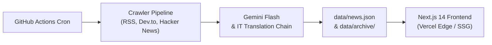

# ClearWind Tech News

Nền tảng tổng hợp và tóm tắt tin tức công nghệ song ngữ (Việt - Anh) vận hành tự động 24/7. Dự án kết hợp Next.js 14, Google Gemini Flash và cơ chế Git-as-Database để duy trì cập nhật liên tục với chi phí vận hành 0đ.

---

## Kiến trúc hệ thống



1. **Thu thập dữ liệu**: Tự động cào tin định kỳ từ các nguồn công nghệ uy tín (70% Việt Nam, 30% Quốc tế).
2. **Xử lý nội dung**: Lọc bỏ nội dung phi công nghệ, trích xuất toàn văn, tóm tắt 3 điểm cốt lõi và dịch song ngữ chuẩn thuật ngữ IT.
3. **Lưu trữ & Lập chỉ mục**: Phân vùng dữ liệu dài hạn theo tháng (`data/archive/YYYY-MM.json`) và tạo chỉ mục tìm kiếm siêu nhẹ (`data/search-index.json`).
4. **Hiển thị**: Web tĩnh tối ưu SEO, tải trang tức thì, hỗ trợ đọc offline qua `localStorage`.

---

## Tính năng chính

- **Tự động hóa 24/7**: Chạy hoàn toàn tự động qua GitHub Actions, tự commit dữ liệu mới mà không cần can thiệp thủ công.
- **Song ngữ hoàn chỉnh (VI / EN)**: Mọi bài viết đều có tiêu đề và 3 điểm tóm tắt kỹ thuật ở cả hai ngôn ngữ. Chuyển đổi ngôn ngữ chỉ với một phím bấm (`L`).
- **Kho lưu trữ dài hạn & Tìm kiếm nhanh**: Không xóa tin cũ; hỗ trợ lọc theo chuyên mục, theo tháng phát hành và tìm kiếm tức thì qua Spotlight Modal (`Ctrl + K`).
- **Trải nghiệm đọc tập trung**:
  - Giao diện Dark mode tối giản phong cách Linear / Daily.dev.
  - Reader Mode có thể tùy chỉnh kích thước chữ.
  - Lưu bài viết (Bookmark) và đánh dấu đã đọc vào trình duyệt mà không cần tài khoản đăng nhập.
  - Thumbnail dự phòng hiện đại với icon chuyên ngành và độ tương phản cao cho các bài không có ảnh.

---

## Công nghệ sử dụng

- **Frontend**: Next.js 14 (App Router), TypeScript, Tailwind CSS, Lucide Icons.
- **AI & Dịch thuật**: Google Gemini API (`gemini-2.5-flash`), đa kênh dịch dự phòng Google Translate + MyMemory.
- **Xử lý dữ liệu**: `rss-parser`, Zod Schema Validation, SHA-256 URL Deduplication.
- **Lưu trữ & CI/CD**: Git-as-Database, GitHub Actions Workflow, Vercel Platform.

---

## Cài đặt và chạy cục bộ

### 1. Clone mã nguồn và cài đặt dependencies

```bash
git clone https://github.com/ClearWind9u/ClearWind-Tech-News.git
cd ClearWind-Tech-News
npm install
```

### 2. Cấu hình biến môi trường (Tùy chọn)

Tạo file `.env.local` ở thư mục gốc nếu muốn sử dụng Gemini API trực tiếp:

```env
GEMINI_API_KEY=your_gemini_api_key_here
```

*Lưu ý: Nếu không có API Key, hệ thống sẽ tự động sử dụng Fallback Translation Engine tích hợp sẵn để phục vụ phát triển giao diện.*

### 3. Các lệnh thường dùng

```bash
# Khởi chạy giao diện ở môi trường local
npm run dev

# Chạy crawler cào và tóm tắt tin mới
npm run fetch-news

# Dọn dẹp và chuẩn hóa dữ liệu tin tức
npm run clean-db

# Kiểm tra kiểu dữ liệu và build ứng dụng
npm run build
```

Mở trình duyệt tại `http://localhost:3000` để xem kết quả.

---

## Cấu trúc thư mục

```text
├── .agents/          # Quy chuẩn kiến trúc, skills và prompt templates
├── app/              # Next.js App Router (trang chủ, API routes, RSS feed)
├── components/       # Các UI components (NewsCard, Spotlight, Modal, Filters)
├── data/
│   ├── news.json     # Dữ liệu tin tức chính đang hiển thị
│   ├── archive/      # Phân vùng lưu trữ theo tháng (YYYY-MM.json)
│   └── search-index.json # Chỉ mục tìm kiếm nén
├── lib/              # Logic truy xuất database và lưu trữ phân vùng
├── scripts/          # Pipeline cào tin, bộ dịch IT và công cụ kiểm định
└── types/            # Định nghĩa kiểu dữ liệu TypeScript và Zod schema
```

---

## Triển khai

1. **Frontend (Vercel)**: Kết nối repository với Vercel, framework Next.js sẽ được nhận diện và triển khai tự động.
2. **Tự động hóa (GitHub Actions)**:
   - Thêm secret `GEMINI_API_KEY` vào **Settings** -> **Secrets and variables** -> **Actions** (nếu có).
   - Trong **Settings** -> **Actions** -> **General** -> **Workflow permissions**, chọn **Read and write permissions** để cronjob có quyền commit dữ liệu mới.
