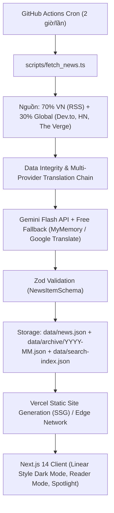

# Architecture & Technical Conventions (Long-Term Memory)

Tài liệu lưu trữ kiến trúc lõi, data flow, schema chuẩn và quy ước kỹ thuật của dự án **ClearWind Tech News**.

---

## 1. Kiến Trúc Tổng Thể & Data Flow

---

## 2. Quy Chuẩn Phân Chia Tầng Mã Nguồn (Topology Rules)

- `app/`: Next.js 14 App Router.
  - Mặc định sử dụng **React Server Components (RSC)** cho layout, SEO metadata, RSS feed.
  - API Routes: `app/api/news/route.ts`, `app/api/archive/route.ts`.
- `components/`: UI Components với Tailwind CSS.
  - Các component tương tác sử dụng `'use client'`: `NewsAppClient`, `NewsCard`, `SpotlightSearchModal`, `BookmarkDrawer`, `CategoryFilter`, `BilingualContext`.
  - Design aesthetic: Phong cách Dark mode tối giản (Linear / Daily.dev / Raycast), contrast cao, quầng neon ambient glow, không dùng Tailwind dynamic interpolation `dark:${var}`.
- `scripts/`:
  - `fetch_news.ts`: Crawler pipeline cào tin, bóc tách toàn văn, gắn guard song ngữ 4 lớp và gọi AI.
  - `it_translator.ts`: Bộ đa kênh dịch thuật kỹ thuật (Google Translate Mobile + Extension + MyMemory) và từ điển thuật ngữ IT chuyên sâu.
  - `clean_news_db.ts`: Kiểm định tính toàn vẹn dữ liệu, loại bỏ tin phi IT, giải mã HTML entity lồng nhau.
  - `reindex_archive.ts`: Tái lập phân vùng lưu trữ theo tháng và cập nhật chỉ mục tìm kiếm nén.
  - `audit_dead_links.ts`: Pipeline rà soát link bài viết cũ (HTTP HEAD, concurrency pool, chốt ngắt an toàn 20%), tự động loại bỏ dead links hàng ngày.
- `lib/`:
  - `db.ts`: Universal DB Layer hỗ trợ lưu trữ cục bộ, Git-as-DB, phân vùng `saveToArchive()`, giải mã ký tự lạ `sanitizeArticleStrings()`, và đồng bộ cloud (Upstash KV/Gist nếu cấu hình).
- `types/`:
  - `types/news.ts`: Zod schema `NewsItemSchema`, `NewsDatabaseSchema`, `SearchIndexItem`, `ArchiveManifest`.
- `data/`: **[CỰC KỲ HẠN CHẾ ĐỌC NGUYÊN FILE]**
  - `news.json`: Danh sách tin tức hiện hành.
  - `archive/YYYY-MM.json`: Phân vùng dữ liệu theo từng tháng để lưu trữ dài hạn.
  - `search-index.json`: Chỉ mục tìm kiếm siêu nhẹ (chỉ gồm id, tiêu đề, category, date, score).

---

## 3. Quy Chuẩn Dữ Liệu & Song Ngữ (Data & Bilingual Standards)

1. **4 Lớp Guard Bắt Buộc (`ensureStrictBilingualQuality`)**:
   - `title_vi`: Bắt buộc chứa dấu tiếng Việt hợp lệ, khác `title_en` đối với tin quốc tế.
   - `title_en`: Bắt buộc thuần tiếng Anh, tuyệt đối không chứa dấu tiếng Việt.
   - `summary_vi`: Mảng đúng 3 chuỗi, **100% các câu** phải có dấu tiếng Việt chuẩn IT.
   - `summary_en`: Mảng đúng 3 chuỗi tiếng Anh tương ứng.
2. **Công Thức Tóm Tắt 3 Điểm Vàng (3-Tier Takeaways)**:
   - Ý 1: Bối cảnh, bản chất công nghệ hoặc bài toán thực tế.
   - Ý 2: Giải pháp kỹ thuật, cơ chế hoạt động, kiến trúc phần mềm hoặc số liệu.
   - Ý 3: Ý nghĩa thực tiễn cho lập trình viên và tác động tới ngành IT.
3. **Giải Mã HTML Entity (Multi-pass decoding)**:
   - Toàn bộ chuỗi văn bản (`originalTitle`, `title_vi`, `title_en`, `contentSnippet`, `summary`) và URL thumbnail đều phải chạy qua `decodeHtml()` để giải mã triệt để các thực thể lồng nhau (`&amp;apos;` $\rightarrow$ `'`, `&#038;` $\rightarrow$ `&`).
4. **Không Đọc Nguyên File Data**:
   - Khi cần kiểm tra dữ liệu, chỉ lấy 1-2 object mẫu thông qua terminal script (`node -e`), không mở toàn bộ `news.json`.

---

## 4. Danh Mục Kỹ Năng (Project Skills) & Quy Chuẩn Đột Phá Độc Bản

Dự án áp dụng hệ thống kỹ năng chuyên biệt trong `.agents/skills/`:
- **`grounded-innovative-architect`**: [Mới] Nguyên tắc nghiên cứu thực chứng từ 2-3 nguồn uy tín cao (Vercel, Linear, Stripe, Hacker News, RFCs...). **Nghiêm cấm ý tưởng vô căn cứ, nghiêm cấm sao chép rập khuôn những mô hình đại trà**. Bắt buộc phân tích đa chiều (Pros/Cons) và tổng hợp giải pháp độc bản, tối ưu nhất cho bài toán 0đ chi phí.
- **`user-interest-recommendation-engine`**: Thuật toán vector tính điểm tương đồng tin tức và tracking người dùng bảo mật client-side (`localStorage`).
- **`tasteful-modern-uiux`**: Bảng mã màu OLED, hiệu ứng kính mờ glassmorphism và viền ambient glow phong cách Linear.
- **`data-integrity-guard`**: Nguyên tắc Zero Hallucination, bóc tách dữ liệu bằng Zod Schema và toán tử nullish (`??`).
- **`gemini-news-summarizer`**: System prompt và quy trình gọi LLM tóm tắt 3 điểm vàng.
- **`bilingual-it-translator`**: Từ điển thuật ngữ IT đối sánh và chuỗi dịch thuật dự phòng nhiều tầng.
- **`news-archive-and-indexing-engine`**: Phân vùng dữ liệu theo tháng và chỉ mục tìm kiếm nén.
- **`rss-crawler-pipeline`**: Danh mục nguồn tin 70% VN + 30% Global và kỹ thuật parse RSS an toàn.
- **`github-actions-scheduler`**: Tự động hóa pipeline cào tin và build deploy 0đ chi phí.
- **`project-invariants-keeper`**: [Mới] Quản trị và duy trì các yêu cầu bất biến (Dark/Light mode, Song ngữ VI/EN, Zero Login, Lucide Icons, Schema Validation, Free-tier 0đ...) theo `INVARIANTS.md`, chống context drift khi phát triển tiếp.

